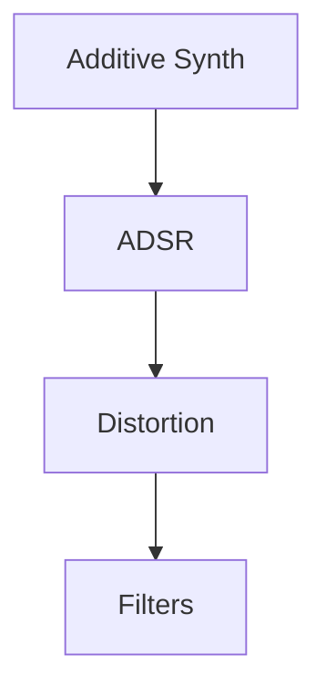

# Interactive WEB app with RNBO

This demo can be used as a template or a starting point to develop interactive audio web apps.

## Pre-requisits

MAX MSP + RNBO 
IDE/Text Editor
Browser (Chrome, Firefox, Safari, etc)

The main framework consists of 3 main components,
## RNBO

RNBO is a platform developed by Cycling '74 for creating portable, real-time audio processing patches. It allows users to design audio effects and instruments in Max, export them as code, and run them efficiently in web browsers, embedded devices, or other environments. RNBO enables seamless integration of interactive audio features into web applications.

Find out more [here.](https://rnbo.cycling74.com/)

For the sake of this demo, I have put together a basic synth patch with simple effects. 



There are more details of each component inside the RNBO Patch file. 


## Website (HTML + JS)

The website is built off of [rnbo.example.webpage](https://github.com/Cycling74/rnbo.example.webpage).

I have removed most of the default UI and only left the parameter sliders. 
Changes included:
1) Removing unwanted UI div's from index.html
2) Removing unwanted function calls from app.js, The main structure of app.js was not removed to allow further exploration of how certain rnbo features can be utilised on web. 

## p5.js 

A simple p5.js implementation was added app.js to draw a seqencer. Here is the same in a [p5.js editor](https://editor.p5js.org/yashiquechalil/sketches/cM46NDeF9) that you can tweak around. 

Todo: Use P5 styling for button and BPM param?

## Smartphone Sensor Reading

The RNBO web inference can be interfaced with motion and haptic sensors available on smartphones. This can be used to create interactive/gestural music controllers. For this example I have set up a simple example of the same. The smartphones orientation motion sensors have been scaled and mapped to a few paramters in the RNBO patch using WEB API's.

[Web API for device orientation event](https://developer.mozilla.org/en-US/docs/Web/API/Window/deviceorientation_event)

alpha (α) – rotation around z‑axis (twist):
  - 0° when the top points North, increasing counterclockwise (90° = West) 

beta (β) – rotation around x‑axis (tilt forward/back):
  - Range: –180° (backwards) to +180° (forwards)

gamma (γ) – rotation around y‑axis (tilt left/right):
  - Range: –90° (left) to +90° (right)

[Read More here](https://developer.mozilla.org/en-US/docs/Web/API/Device_orientation_events/Orientation_and_motion_data_explained)


## Directions to setup

To-do (Explain further)
1) Clone Repo
2) set up ssl certificate 
  Browsers block access to sensitive APIs like sensors on non-secure (HTTP) origins. To use HTTPS with your local RNBO site (especially to access phone sensors like orientation/motion), you'll need to serve it over HTTPS rather than HTTP. 
  You can run http-server with HTTPS by generating a self-signed certificate:
  
  Step 1: Generate SSL certificate and key
  Open a terminal in your project folder and run:
  ```
  mkdir ssl
  openssl req -new -x509 -keyout ssl/key.pem -out ssl/cert.pem -days 365 -nodes
  ```
  Note: Just press Enter through the questions.
  
  Step 2: Run http-server with HTTPS
  ```
  npx http-server -S -C ssl/cert.pem -K ssl/key.pem
  ```

3) Open the link local IP (192.168.x.x:<portNumber>)
   Make sure to open the site with https for example, https://192.168.3.24:8080