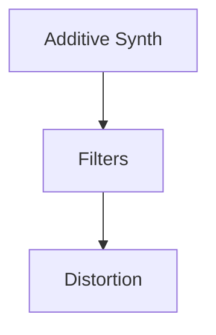

# Interactive WEB app with RNBO

This demo can be used as a template or a starting point to develop interactive audio web apps.

## Pre-requisits

MAX MSP + RNBO 
IDE/Text Editor
Browser (Chrome, Firefox, Safari, etc)

The main framework consists of 3 main components,
## RNBO

RNBO is a platform developed by Cycling '74 for creating portable, real-time audio processing patches. It allows users to design audio effects and instruments in Max, export them as code, and run them efficiently in web browsers, embedded devices, or other environments. RNBO enables seamless integration of interactive audio features into web applications.

Find out more [here.](https://rnbo.cycling74.com/)

For the sake of this demo, I have put together a basic synth patch with simple effects. 

There are more details of each component inside the RNBO Patch file. 

## Website (HTML + JS)

The website is built off of [rnbo.example.webpage](https://github.com/Cycling74/rnbo.example.webpage).

I have removed most of the default UI and only left the parameter sliders. 
Changes included:
1) Removing unwanted UI div's from index.html
2) Removing unwanted function calls from app.js, The main structure of app.js was not removed to allow further exploration of how certain rnbo features can be utilised on web. 

### p5.js 

A simple p5.js implementation was added app.js to draw a seqencer. Here is the same in a [p5.js editor](https://editor.p5js.org/yashiquechalil/sketches/cM46NDeF9) that you can tweak around. 

## Device Sensor Reading

